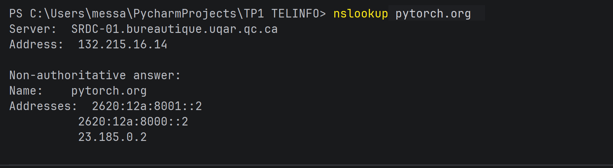
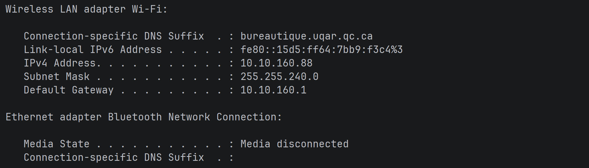
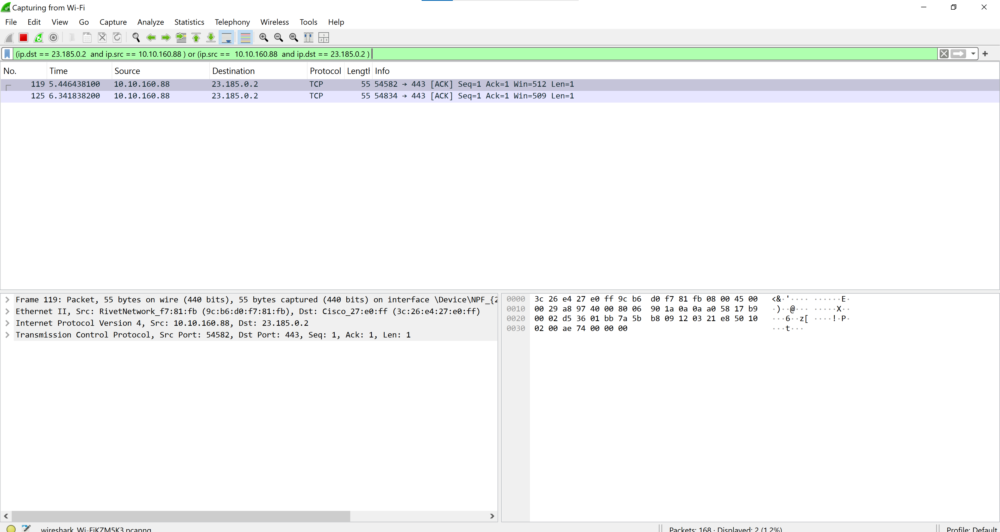
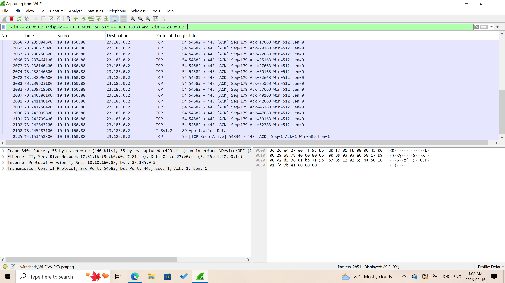
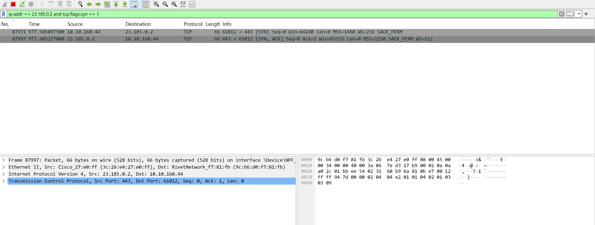

# Travail pratique 1 - Protocoles des modèles OSI et TCP/IP

## 1. Analyse de la connexion à pytorch.org

### a) Adresse IP du serveur web hébergeant pytorch.org

**Adresse IP :** 23.185.0.2

### b) Adresse IP locale

**Adresse IP :** 10.10.160.88

### c) Capture Wireshark

### d) Filtre d'affichage pour isoler le trafic

**Filtre utilisé :** (ip.dst == 23.185.0.2 and ip.src == 10.10.160.88) 
                    or (ip.src == 23.185.0.2 and ip.dst == 10.10.160.88)

## 2. Analyse de l'établissement de connexion TCP

### a) Three-way handshake
- **Premier paquet (SYN client)** : Numéro de séquence = 0
- **Deuxième paquet (SYN-ACK serveur)** : Numéro d'acquittement = 1
- **Établissement de connexion** : La connexion a été établie du premier coup (SYN → SYN-ACK → pas de retransmission)

### b) Taille de fenêtre
**Valeur initiale :** Win = 65535

### c) Variation de la taille de fenêtre
Oui, la taille de la fenêtre varie pendant le chargement de la page.

### d) Conformité avec la théorie TCP
Le processus observé correspond exactement à la théorie TCP :
1. Établissement de connexion (3-way handshake)
2. Échange TLS
3. Transfert des données (Application Data)

### e) Identification de l'établissement TLS
Oui, on identifie clairement l'établissement de la connexion TLS.

## 3. Analyse des segments, paquets et trames

### 3.1 En-tête Ethernet

**a) Adresse MAC source**
- **Valeur :** 88:d8:2e:f5:d4:30
- **Premier octet :** 88 = 10001000 (bit individuel/groupe = 0 → adresse unicast, bit global/local = 0 → adresse globale)
- **Type :** Adresse globale

**b) Adresse MAC destination**
- **Valeur :** ac:3b:77:a8:a6:30
- **Premier octet :** ac = 10101100 (bit individuel/groupe = 1 → adresse multicast ? À vérifier)
- **Type :** Adresse globale

**c) Type de protocole supérieur**
- **Valeur :** 08 00 = 0x0800
- **Protocole :** IPv4

### 3.2 En-tête IP

**a) Version IP**
- **Premier octet :** 45
- **Version :** IPv4 (4)

**b) Longueur de l'en-tête**
- **IHL (Internet Header Length) :** 5
- **Longueur :** 5 × 4 = 20 octets
- **Options :** Non (en-tête minimal)

**c) DSCP et ECN**
- **Deuxième octet :** 00
- **DSCP :** 0
- **ECN :** 0

**d) Durée de vie (TTL)**
- **Valeur hexadécimale :** 3f
- **Valeur décimale :** 63

**e) Protocole utilisé**
- **Valeur hexadécimale :** 06
- **Protocole :** TCP

**f) Adresse IP source**
- **Valeur hexadécimale :** c0 a8 02 c9
- **Conversion décimale :** 192.168.2.201

**g) Adresse IP destination**
- **Valeur hexadécimale :** 80 77 f5 0c
- **Conversion décimale :** 128.119.245.12

**h) Options IP**
- Non (IHL = 5 → en-tête minimal de 20 octets)

### 3.3 En-tête TCP (RFC 793)

**a) Port source**
- **Valeur hexadécimale :** 0xF5 0C
- **Port :** 62732 (port éphémère client)

**b) Port destination**
- **Valeur hexadécimale :** 0xE8 42
- **Port :** 80 (HTTP)

**c) Numéro de séquence**
- **Valeur hexadécimale :** 00 50 c5 85
- **Valeur :** 0x0050C585

**d) Numéro d'acquittement (ACK)**
- **Valeur hexadécimale :** 96 f5 81 9a

**e) Longueur de l'en-tête**
- **Valeur hexadécimale :** c6
- **Binaire :** 1100 0110
- **Data Offset (4 premiers bits) :** 1100₂ = 12
- **Longueur totale :** 12 × 4 = 48 octets
- **Options :** Oui (car > 20 octets)

**f) Bits de contrôle**
- **Valeur hexadécimale :** 74
- **Binaire :** 0111 0100
- **Drapeaux actifs :** ACK = 1, PSH = 1, RST = 1 (selon découpage exact)
- **Type de segment :** Segment de données (pas un SYN)

**g) Taille de la fenêtre**
- **Valeur hexadécimale :** 01 fb
- **Valeur décimale :** 507

**h) Pointeur urgent**
- **Valeur :** 00 00 (pas de données urgentes)

**i) Données transportées**
- **Début des données :** Après 48 octets d'en-tête TCP
- **Premier octet des données :** 47 (hex)
- **Dernier octet visible :** 0a
- **Contenu de la requête :**

 

